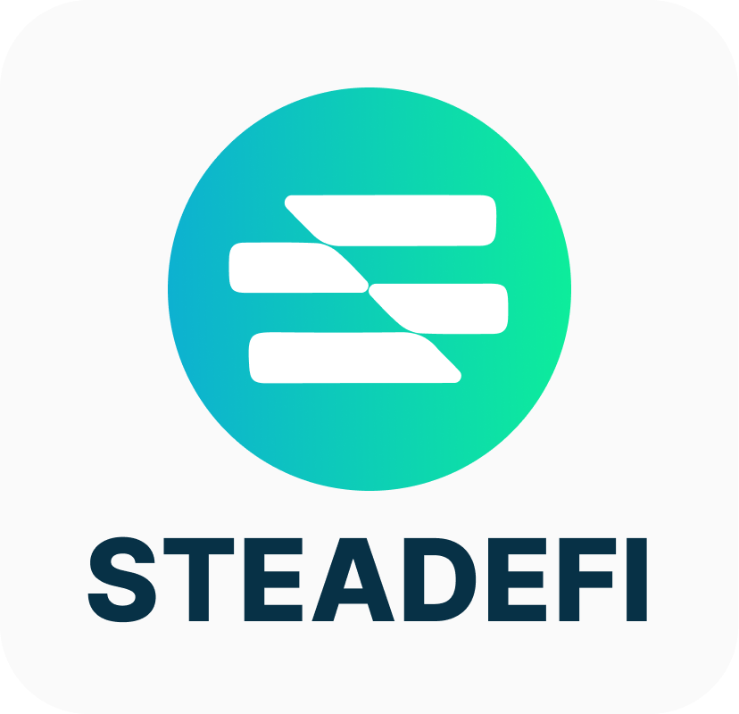

# Steadefi Codehawks Audit
​
<p align="center">
  
</p>

​
## Contest Details
- Total Prize Pool: $35,000
  - High/Medium Awards: $33,000
  - Low, gas, informational, or QAs Awards: $2,000
- Start: 26th October 2023 12:00pm UTC
- End: 6th November 2023 12:00pm UTC
​

## Stats
- nSLOC: 2,289
- Complexity Score: 1,634
- Dollars per nSLOC: ~$15
- Dollars per Complexity: ~$21
​
## About
Steadefi provides vaults with automated risk management for earning leveraged yields effectively and passively in bull, crab and bear markets. With lending and leveraged delta long and neutral stategies, Steadefi's vaults cater to different risk/reward strategies to the best yield-generating DeFi protocols.

As of October 2023, Steadefi is looking to launch vaults that earn yield from GMX v2 on Arbitrum and Avalanche network.
​

## Official Links
- [Protocol Documentation](https://docs.steadefi.com)
- [Website](https://www.steadefi.com)
- [Front-End Interface](https://www.steadefi.com/vaults)
- [Blog](https://blog.steadefi.com)
- [Twitter](https://twitter.com/steadefi)
- [Discord](https://discord.gg/steadefi)
​

## Protocol Overview
There are 2 types of vaults: **Lending Vaults** and **Strategy Vaults**.

A typical set up for 3x Leverage, Delta Long and Delta Neutral strategies to the ETH-USDC GM LP pool on GMXv2, with isolated ETH and USDC lending vaults are as follows:


> Note that Delta Long strategies borrow only USDC for more leverage, while Delta Neutral strategies borrow both USDC for leverage **as well as** borrow ETH in order to delta hedge the ETH exposure of the liquidity provided to the ETH-USDC GM LP pool (borrowing = hedging).

### Further Technical Documentation
🚨 **For more details, please check out the [Technical Documentation](./docs/technical-documentation.md) directory in this repository.**

### Recorded Video for Codehawks
[Recorded Explainer Video](https://www.loom.com/share/88ce04a31a4343439cdc9501a6a9448a)

## Actors
| Role | Responsibilities |
| ------ | --------------- |
| Lender | Lenders deposit assets to Lending Vaults (1 asset per Lending Vault) to earn safer, more stable borrow interest on their assets. |
| Depositor | Depositors deposit assets to Strategy Vaults (Strategy Vaults could accept different assets) to earn earn higher yields than if they were to supply their assets to the yield-earning protocol directly. Depending on the strategy however, they take on different types of risk which would affect their final profit and losses. |
| Keeper | Keepers are automated "bots" that run 24/7, frequently scheduled and/or event-triggered code scripts to perform various protocol maintainence tasks. These tasks include updating of borrow interest rates for Lending Vaults, rebalancing Strategy Vaults whose health are out of its' strategy parameter limits, compounding earned yield for Strategy Vaults, reverting certain issues for strategy vaults when they occur and triggering Emergency Pauses for lending and strategy vaults in the event of any possible issues. |
| Owner | Owner are administrators that have rights to configure and update various sensitive vault configurations and parameters. Owners of deployed smart-contracts (vaults, oracles, etc.) should be Timelocks of which are managed by Multi-Sigs that require at least a 2 out of 3 signing approval for any transactions to happen with a 24 hours delay. Note that on contract deployment, the immediate Owner is the hot wallet deployer account. After deploying and initial configuration of the contract, the ownership should be immediately transferred from the hot wallet deployer to a Timelock managed by a Multi-Sig. |


## Scope
### Contracts in scope:
```js
contracts
├── interfaces
    ├── oracles
        ├── IChainlinkOracle.sol
        ├── IGMXOracle.sol
    ├── strategy
        ├── gmx
            ├── IGMXVault.sol
            ├── IGMXVaultEvent.sol
├── oracles
        ├── ChainlinkARBOracle.sol
        ├── GMXOracle.sol
├── strategy
        ├── gmx
            ├── GMXCallback.sol
            ├── GMXChecks.sol
            ├── GMXCompound.sol
            ├── GMXDeposit.sol
            ├── GMXEmergency.sol
            ├── GMXManager.sol
            ├── GMXProcessDeposit.sol
            ├── GMXProcessWithdraw.sol
            ├── GMXReader.sol
            ├── GMXRebalance.sol
            ├── GMXTrove.sol
            ├── GMXTypes.sol
            ├── GMXVault.sol
            ├── GMXWithdraw.sol
            ├── GMXWorker.sol
└── utils
    ├── Errors.sol
```

### Contracts out of scope:
```js
contracts
├── interfaces
    ├── lending
    ├── protocols
    ├── swap
    ├── tokens
├── lending
├── oracles
    ├── ChainlinkOracle.sol
├── mocks
├── swaps
​
```
​
## Compatibilities
Blockchains:
  - Arbitrum
  - Avalanche

Tokens on Arbitrum:
  - ETH
  - WETH: `0x82aF49447D8a07e3bd95BD0d56f35241523fBab1`
  - WBTC: `0x2f2a2543B76A4166549F7aaB2e75Bef0aefC5B0f`
  - ARB: `0x912CE59144191C1204E64559FE8253a0e49E6548`
  - LINK: `0xf97f4df75117a78c1a5a0dbb814af92458539fb4`
  - SOL: `0x2bCc6D6CdBbDC0a4071e48bb3B969b06B3330c07`
  - UNI: `0xfa7f8980b0f1e64a2062791cc3b0871572f1f7f0`
  - USDC: `0xaf88d065e77c8cC2239327C5EDb3A432268e5831`
  - ETH-USDC GM: `0x70d95587d40a2caf56bd97485ab3eec10bee6336`
  - WBTC-USDC GM: `0x47c031236e19d024b42f8AE6780E44A573170703`
  - ARB-USDC GM: `0xC25cEf6061Cf5dE5eb761b50E4743c1F5D7E5407`
  - LINK-USDC GM: `0x7f1fa204bb700853D36994DA19F830b6Ad18455C`
  - SOL-USDC GM: `0x09400D9DB990D5ed3f35D7be61DfAEB900Af03C9`
  - UNI-USDC GM: `0xc7Abb2C5f3BF3CEB389dF0Eecd6120D451170B50`

Tokens on Avalanche:
  - AVAX
  - WAVAX: `0xB31f66AA3C1e785363F0875A1B74E27b85FD66c7`
  - BTC.b: `0x152b9d0FdC40C096757F570A51E494bd4b943E50`
  - WETH.e: `0x49D5c2BdFfac6CE2BFdB6640F4F80f226bc10bAB`
  - SOL: `0xFE6B19286885a4F7F55AdAD09C3Cd1f906D2478F`
  - USDC: `0xb97ef9ef8734c71904d8002f8b6bc66dd9c48a6e`
  - AVAX-USDC GM: `0x913C1F46b48b3eD35E7dc3Cf754d4ae8499F31CF`
  - BTC.b-USDC GM: `0xFb02132333A79C8B5Bd0b64E3AbccA5f7fAf2937`
  - WETH.e-USDC GM: `0xB7e69749E3d2EDd90ea59A4932EFEa2D41E245d7`
  - SOL-USDC GM: `0xd2eFd1eA687CD78c41ac262B3Bc9B53889ff1F70`
​
## Setup
Install all project dependencies with yarn
```bash
$ yarn
```

Compile all contracts
```bash
$ yarn compile
```

Note: You may need to add Foundry to this Hardhat project if you do not have foundry installed: See instructions hereL: [https://hardhat.org/hardhat-runner/docs/advanced/hardhat-and-foundry](https://hardhat.org/hardhat-runner/docs/advanced/hardhat-and-foundry)

### Deployment
Deploy scripts are all in the `/scripts` directory. Short-cut helper bash functions are in `package.json`.

Note that deployment for different chains or strategies may have different contracts to deploy.

The steps below are for deploying strategy vaults for ETH-USDC on GMX, using Uniswap for asset swaps.

**After deploying a contract successful, the address of the contract should be updated in `constants.ts` file accordingly so future deploy scripts can utilise the correct deployed contracts.**

**0) Add deployer wallet private key to `.env`**

Add deployer private key to `.env`
```javascript
PRIVATE_KEY_DEPLOYER=<PRIVATE_KEY_OF_DEPLOYER_WALLET>
```

**1) Deploy Chainlink Oracle**
```bash
$ npx hardhat run --network arbitrumOne scripts/arb/oracles/deploy-oracle-chainlink-arb.ts
```
Note that the price feeds for ETH and USDC should be updated to this oracle.

This oracle is re-usable for future Arbitrum protocol oracles and strategy vaults.

**2) Deploy GMX Oracle**
```bash
$ npx hardhat run --network arbitrumOne scripts/arb/oracles/deploy-oracle-gmx.ts
```
This oracle is re-usable for future GMX strategy vaults.

**3) Deploy a Swap**
```bash
$ npx hardhat run --network arbitrumOne scripts/arb/swap/deploy-swap-uniswap.ts
```
Note that the fee tiers for ETH and USDC swap pool should be updated in this swap.

This swap is re-usable for future Arbitrum strategy vaults.

**4) Deploy Lending Vaults**
```bash
# Deploy a native ETH Lending Vault
$ npx hardhat run --network arbitrumOne scripts/arb/lending/deploy-lending-vault-native.ts

# Deploy a USDC Lending Vault
$ npx hardhat run --network arbitrumOne scripts/arb/lending/deploy-lending-vault-stable.ts
```

These lending vaults will be re-usable for future ETH-USDC GMX strategy vaults.

**5) Deploy Strategy Vaults**
```bash
# Deploy re-usable strategy vault external library contracts
$ npx hardhat run --network arbitrumOne scripts/arb/strategy/gmx/deploy-strategy-gmx-libraries.ts

# Deploy a Leveraged Long strategy vault
$ npx hardhat run --network arbitrumOne scripts/arb/strategy/gmx/deploy-strategy-gmx-long-eth.ts

# Deploy a Leveraged Neutral strategy vault
$ npx hardhat run --network arbitrumOne scripts/arb/strategy/gmx/deploy-strategy-gmx-neutral-eth.ts
```

The library contracts deployed will also be re-usable for other GMX strategy vaults.

**5) Post-Deployment Setup (optional for audit)**
- Configure Keepers (Relayers, Sentinels, Autotasks)
- Configure back-end data collection and database
- Configure front-end interface
​

### Testing

Tests coverage
```bash
$ forge coverage
```

Run all tests
```bash
$ forge test
```

Run a particular test suite
```bash
$ forge test --match-contract GMXDepositTest
```

Run a particular test with calltrace
```bash
$ forge test --match-test test_createDeposit -vvvv
```

## Additional Context
- **Chainlink price feed dependency**
    - The protocol is dependent on Chainlink price feeds operating accurately and correctly. In situations where it does not, the oracle contracts would already revert, therefore preventing further actions with the vaults.
    - It should be assumed that for all accepted tokens in this protocol, there is a price feed for it (the "GM" LP tokens' price comes from GMX itself which uses Chainlink as well)
- **Keeper dependency**
    - The strategy vaults are dependent on keepers running to compound and rebalance the vaults periodically. It should be assumed that the keepers will always be able to run 24/7 to trigger the right functions. However, if there can be issues arising due to such functions, please report them as findings.
- **GMXTrove only applies if reward tokens are the same as vault's tokenA/tokenB and are airdropped to vault**
- **It is expected that Neutral strategy vaults will have a leverage factor of 3x and above**
    - A leverage of less than 3x (e.g. 2x) for Neutral strategies may not work to correctly to borrow enough long token to hedge while still adhering to the correct leverage factor.
    - The issue will arise in `GMXManager.calcBorrow()` and `GMXReader.additionalCapacity()` where the computation of shortToken (tokenB) to borrow may underflow.
    - However, Long strategies are OK to have 2x as they simply borrow short token to leverage up.
    - As it does not make sense to deploy a Neutral strategy vault with less than 3x leverage as the strategy will fail, we did not add checks to this in the constructor function.
- **Rounding errors**:
    - Conversion between scaled and normalized balances inherently incurs some rounding error; we consider rounding errors limited to "dust" (miniscule amounts left unaccounted for) out of scope unless they lead to additional unexpected behavior (e.g. if a rounding error can prevent withdrawal batches from being closed).
- **Accounting terms**:
    - Assets = Equity + Debt
    - Equity = what depositors put into vault
    - Debt = loans from Lending vaults
    - Delta = Refers to the position exposure of this vault's strategy to the underlying volatile asset. Delta can be a negative value.
​
## Known Issues

- **Vault inflation attack**
    - Just like other smart contract vaults (like ERC-4626 standard), the vaults are also susceptible to a Inflation/Donation Attack that can be carried out by the first depositor to the vault. We will mitigated this by being the first to deposit a small amount to any new vaults and sending the vault share tokens to the vault contract itself, so it will not be accessible to anyone.
- **GMX Callback failures**
    - The strategy vaults are dependent on GMX's callback to work. GMX's callbacks are only triggered when GMX's keepers successful execute the deposit/withdraw liquidity orders that our vaults submit to it. If GMX's keepers do not work for whatever reason, there is nothing we can do except to cancel the order request. Note that if the attempt to trigger the callback to the vaults by GMX went through BUT it failed, then this should be a finding, as it could be due to faulty code logic on our vaults or too much gas being used in the callback function (there is a 2 million gas limit for callback functions).
- **No zero address on constructor and functions**
    - We have removed zero address checks on constructor and functions unless they are critical to the core/logic of the vault. This is to reduce gas fees incurred for every trigger of the function, as the function may revert naturally when a zero address is passed in. For e.g., no zero address check needed for getting token price/value from oracles.
- **Post successful compound() may result in vault's health being out of balance**
    - It is OK for deposit/withdrawals when vault status is out of range, as any deposits will bring vault closer to target leverage and delta, and withdrawals will still obtain their assets accurately and accordingly. If this is found to NOT be the case, then please report this as a finding.
- **There needs to be enough lending capacity for a successful rebalance**
    - There can be a situation where there is not enough lending capacity to rebalance the vault correctly (e.g. not enough lending capacity to borrow, so the vault's debt ratio is under the lower debt ratio parameters). The strategy vault can only wait until there is enough lending capacity in order to execute a successul rebalance.
- **Swap deadline is consciously set as block.timestamp for certain functions**
    - In: `GMXDeposit.processDepositFailureLiquidityWithdrawal() and `GMXProcessWithdraw.processWithdraw()`
    - Reminder: A swap deadline timestamp is passed to protect against miners delaying swap transactions until a more favourable time for them to process it.
    - However for the above 2 functions that implements a swap, we decided to allow the deadline to be set as the current block timestamp for these function as they are triggered as a follow up function (by a callback/keeper) and not directly by a user/keeper. If this follow on functions revert due to the swap transaction being processed after a set fixed deadline timestamp, this will cause the vault to be in a "stuck" state. To resolve this, this function will have to be called again with an updated deadline until it succeeds/a miner processes the transaction.
- **PUSH0 opcode with Solidity version 0.8.21 unsupported on L2 networks**
     - Known issue and does not cause any issues during compile or runtime during testing

## Attack ideas (Where to look for bugs)
- **General**
    - Lenders from lending vaults should be protected from any bad debt or loss of funds as a result of vault's actions. Any flow that results in lending vaults not getting paid back would be critical.
    - Due to design of GMX v2 where adding/removing liquidity involves two transactions, it could lead to internal accounting issues if the various scenarios (success/cancelled/failure) are not handled properly
    - All scenarios should be handled to ensure vault eventually returns to an Open status. Consider how a scenario might lead to a stuck vault (other statuses).
- **Emergency actions**
    - After emergency actions (pause, close) all loans should be repaid, users' funds secured, and all vault activity should be paused except for emergency withdrawals. Consider ways in which this state might be violated.

- **Main invariants**
    - Assuming a 3X leveraged vault, leverage should never deviate too far from 3. Otherwise, it would imply excessive over or under-borrowing from lending vaults which could result in bad debt
    - After every action (deposit/withdraw/rebalance/compound), the vault should be cleared of any token balances. Violation of this could allow a subsequent depositor to benefit from it.
