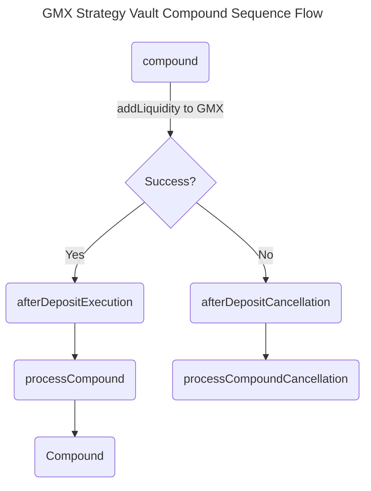

```mermaid
---
title: GMX Strategy Vault Compound Sequence Flow
---
flowchart TD
  F1(compound) -->|addLiquidity to GMX| S1{Success?}
  S1{Success?} -->|Yes| F2([afterDepositExecution])
  S1{Success?} -->|No| F3(afterDepositCancellation)

  F2(afterDepositExecution) --> F4(processCompound)
  F4(processCompound) --> CS(Compound)

  F3(afterDepositCancellation) --> F7(processCompoundCancellation)
```