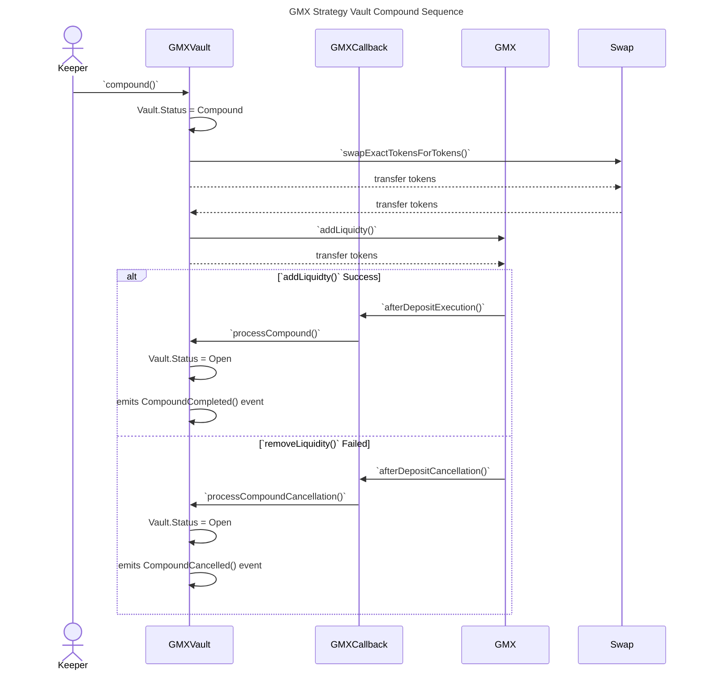

```mermaid
---
title: GMX Strategy Vault Compound Sequence
---
sequenceDiagram
  actor Keeper
  participant GMXVault
  participant GMXCallback
  participant GMX
  participant Swap

  Keeper ->> GMXVault: `compound()`
  GMXVault ->> GMXVault: Vault.Status = Compound

  GMXVault ->> Swap: `swapExactTokensForTokens()`
  GMXVault -->> Swap: transfer tokens
  Swap -->> GMXVault: transfer tokens

  GMXVault ->> GMX: `addLiquidty()`
  GMXVault -->> GMX: transfer tokens

  alt `addLiquidty()` Success
    GMX ->> GMXCallback: `afterDepositExecution()`
    GMXCallback ->> GMXVault: `processCompound()`
    GMXVault ->> GMXVault: Vault.Status = Open
    GMXVault ->> GMXVault: emits CompoundCompleted() event

  else `removeLiquidity()` Failed
    GMX ->> GMXCallback: `afterDepositCancellation()`
    GMXCallback ->> GMXVault: `processCompoundCancellation()`
    GMXVault ->> GMXVault: Vault.Status = Open
    GMXVault ->> GMXVault: emits CompoundCancelled() event

  end
```
