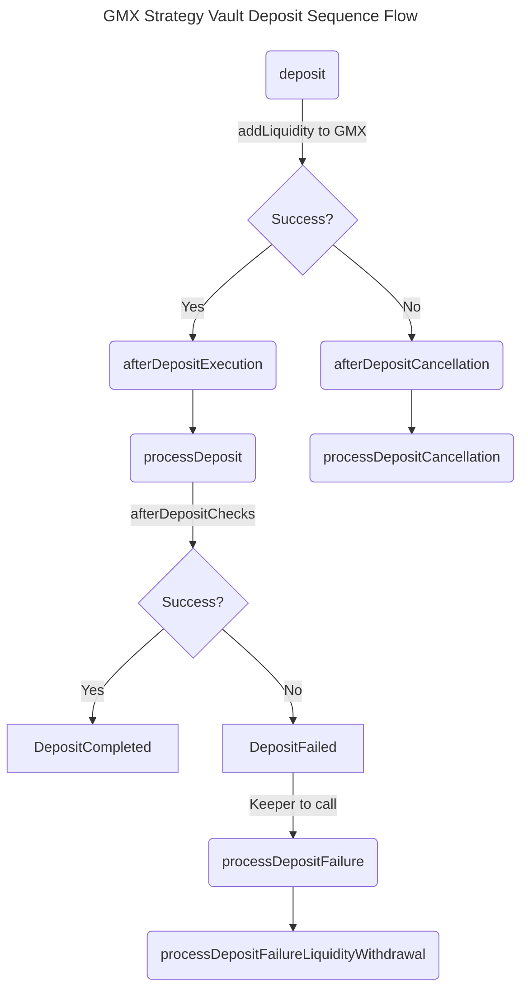

```mermaid
---
title: GMX Strategy Vault Deposit Sequence Flow
---
flowchart TD
  F1(deposit) -->|addLiquidity to GMX| S1{Success?}
  S1{Success?} -->|Yes| F2(afterDepositExecution)
  S1{Success?} -->|No| F3(afterDepositCancellation)

  F2(afterDepositExecution) --> F4(processDeposit)
  F4(processDeposit) -->|afterDepositChecks| S2{Success?}

  S2{Success?} -->|Yes| DC[DepositCompleted]
  S2{Success?} -->|No| DF[DepositFailed]

  DF[DepositFailed] -->|Keeper to call| F5(processDepositFailure)
  F5(processDepositFailure) --> F6(processDepositFailureLiquidityWithdrawal)

  F3(afterDepositCancellation) --> F7(processDepositCancellation)
```