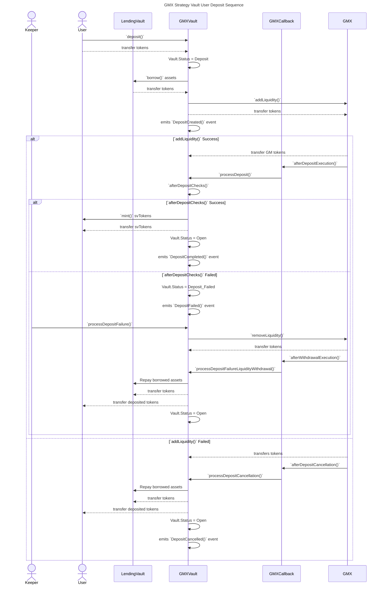

```mermaid
---
title: GMX Strategy Vault User Deposit Sequence
---
sequenceDiagram
  actor Keeper
  actor User
  participant LendingVault
  participant GMXVault
  participant GMXCallback
  participant GMX

  User ->> GMXVault: `deposit()`
  User -->> GMXVault: transfer tokens
  GMXVault ->> GMXVault: Vault.Status = Deposit
  GMXVault ->> LendingVault: `borrow()` assets
  LendingVault -->> GMXVault: transfer tokens
  GMXVault ->> GMX: `addLiquidity()`
  GMXVault -->> GMX: transfer tokens
  GMXVault ->> GMXVault: emits `DepositCreated()` event

  alt `addLiquidity()` Success
    GMX -->> GMXVault: transfer GM tokens
    GMX ->> GMXCallback: `afterDepositExecution()`
    GMXCallback ->> GMXVault: `processDeposit()`
    GMXVault ->> GMXVault: `afterDepositChecks()`

    alt `afterDepositChecks()` Success
      GMXVault ->> User: `mint()` svTokens
      GMXVault -->> User: transfer svTokens
      GMXVault ->> GMXVault: Vault.Status = Open
      GMXVault ->> GMXVault: emits `DepositCompleted()` event

    else `afterDepositChecks()` Failed
      GMXVault ->> GMXVault: Vault.Status = Deposit_Failed
      GMXVault ->> GMXVault: emits `DepositFailed()` event

      Keeper ->> GMXVault: `processDepositFailure()`

      GMXVault ->> GMX: `removeLiquidity()`
      GMX -->> GMXVault: transfer tokens
      GMX ->> GMXCallback: `afterWithdrawalExecution()`
      GMXCallback ->> GMXVault: `processDepositFailureLiquidityWithdrawal()`
      GMXVault ->> LendingVault: Repay borrowed assets
      GMXVault -->> LendingVault: transfer tokens
      GMXVault -->> User: transfer deposited tokens
      GMXVault ->> GMXVault: Vault.Status = Open
    end

  else `addLiquidity()` Failed
    GMX -->> GMXVault: transfers tokens
    GMX ->> GMXCallback: `afterDepositCancellation()`
    GMXCallback ->> GMXVault: `processDepositCancellation()`
    GMXVault ->> LendingVault: Repay borrowed assets
    GMXVault -->> LendingVault: transfer tokens
    GMXVault -->> User: transfer deposited tokens
    GMXVault ->> GMXVault: Vault.Status = Open
    GMXVault ->> GMXVault: emits `DepositCancelled()` event


  end
```
