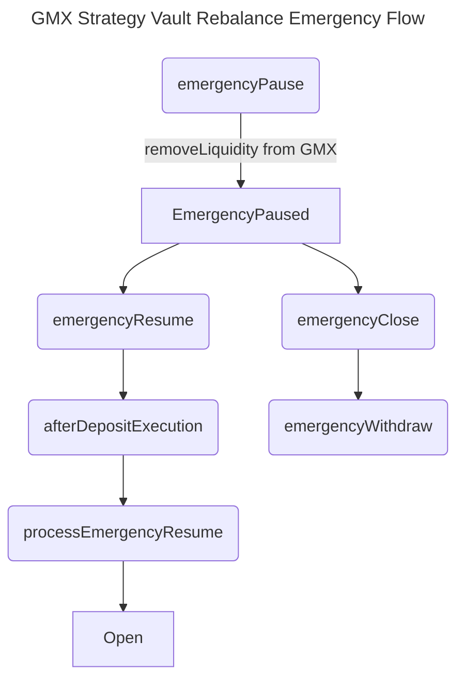

```mermaid
---
title: GMX Strategy Vault Rebalance Emergency Flow
---
flowchart TD
  F1(emergencyPause) -->|removeLiquidity from GMX| EP[EmergencyPaused]

  EP[EmergencyPaused] --> ER(emergencyResume)
  ER(emergencyResume) --> F2(afterDepositExecution)
  F2(afterDepositExecution) --> PER(processEmergencyResume) --> Open

  EP[EmergencyPaused] --> EC(emergencyClose)

  EC(emergencyClose) --> EW(emergencyWithdraw)
```