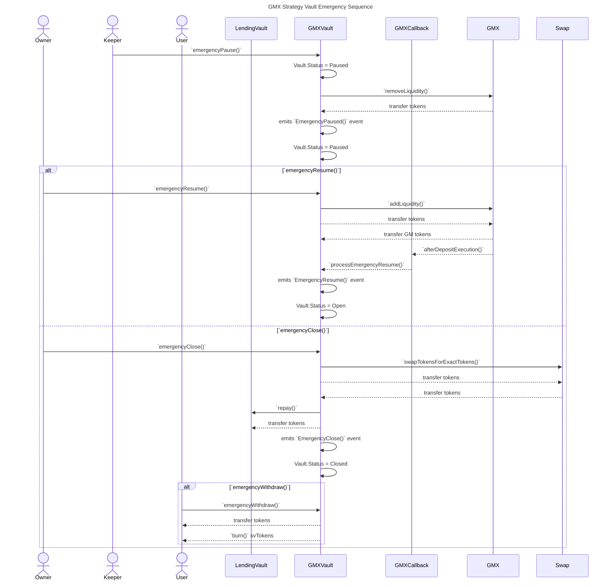

```mermaid
---
title: GMX Strategy Vault Emergency Sequence
---
sequenceDiagram
  actor Owner
  actor Keeper
  actor User
  participant LendingVault
  participant GMXVault
  participant GMXCallback
  participant GMX

  Keeper ->> GMXVault: `emergencyPause()`
  GMXVault ->> GMXVault: Vault.Status = Paused
  GMXVault ->> GMX: `removeLiquidity()`
  GMX -->> GMXVault: transfer tokens

  GMXVault ->> GMXVault: emits `EmergencyPaused()` event
  GMXVault ->> GMXVault: Vault.Status = Paused

  alt `emergencyResume()`
    Owner ->> GMXVault: `emergencyResume()`
    GMXVault ->> GMX: `addLiquidity()`
    GMXVault -->> GMX: transfer tokens
    GMX -->> GMXVault: transfer GM tokens
    GMX -->> GMXCallback: `afterDepositExecution()`
    GMXCallback -->> GMXVault: `processEmergencyResume()`

    GMXVault ->> GMXVault: emits `EmergencyResume()` event
    GMXVault ->> GMXVault: Vault.Status = Open

  else `emergencyClose()`
    Owner ->> GMXVault: `emergencyClose()`
    GMXVault ->> Swap: `swapTokensForExactTokens()`
    GMXVault -->> Swap: transfer tokens
    Swap -->> GMXVault: transfer tokens

    GMXVault ->> LendingVault: `repay()`
    GMXVault -->> LendingVault: transfer tokens

    GMXVault ->> GMXVault: emits `EmergencyClose()` event
    GMXVault ->> GMXVault: Vault.Status = Closed

    alt `emergencyWithdraw()`
      User ->> GMXVault: `emergencyWithdraw()`
      GMXVault -->> User: transfer tokens
      GMXVault -->> User: `burn()` svTokens
    end

  end
```
