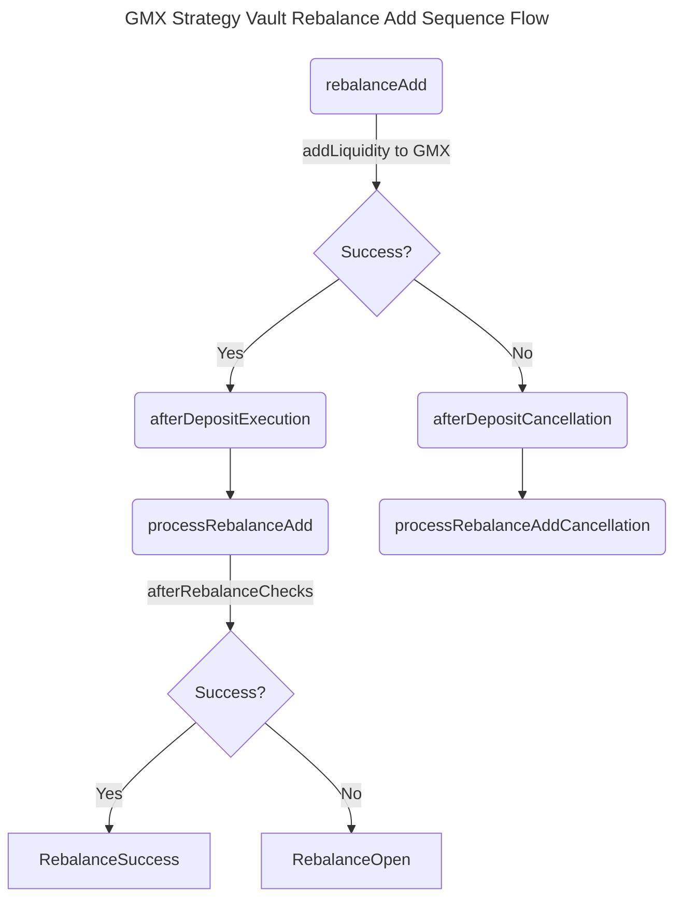

```mermaid
---
title: GMX Strategy Vault Rebalance Add Sequence Flow
---
flowchart TD
  F1(rebalanceAdd) -->|addLiquidity to GMX| S1{Success?}
  S1{Success?} -->|Yes| F2(afterDepositExecution)
  S1{Success?} -->|No| F3(afterDepositCancellation)

  F2(afterDepositExecution) --> F4(processRebalanceAdd)
  F4(processRebalanceAdd) -->|afterRebalanceChecks| S2{Success?}

  S2{Success?} -->|Yes| DC[RebalanceSuccess]
  S2{Success?} -->|No| DF[RebalanceOpen]

  F3(afterDepositCancellation) --> F7(processRebalanceAddCancellation)
```