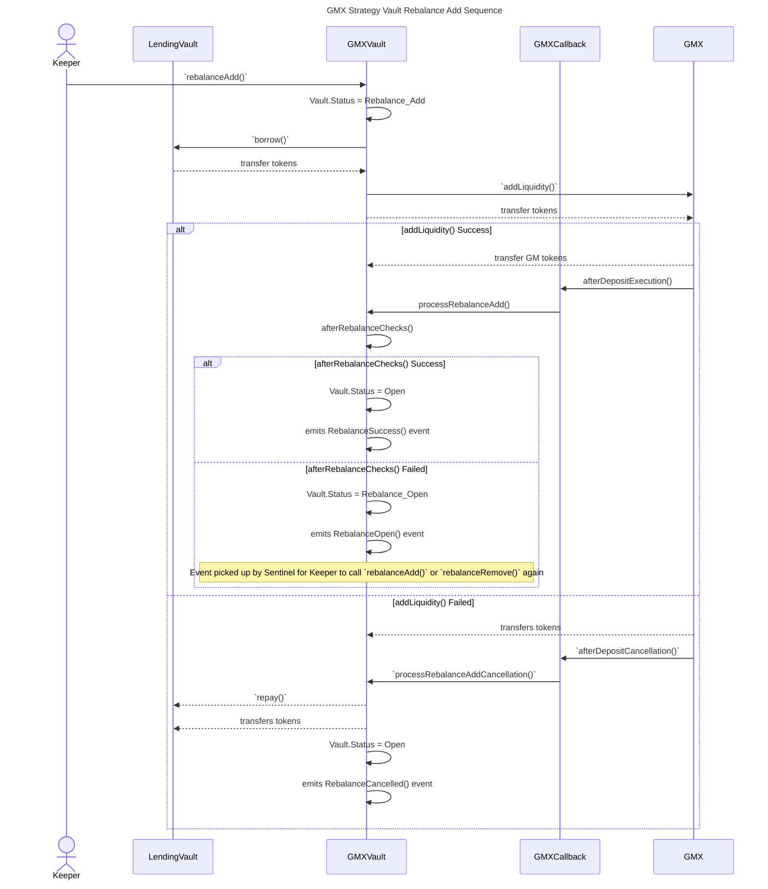

```mermaid
---
title: GMX Strategy Vault Rebalance Add Sequence
---
sequenceDiagram
  actor Keeper
  participant LendingVault
  participant GMXVault
  participant GMXCallback
  participant GMX

  Keeper ->> GMXVault: `rebalanceAdd()`
  GMXVault ->> GMXVault: Vault.Status = Rebalance_Add
  GMXVault ->> LendingVault: `borrow()`
  LendingVault -->> GMXVault: transfer tokens

  GMXVault ->> GMX: `addLiquidity()`
  GMXVault -->> GMX: transfer tokens

  alt addLiquidity() Success
    GMX -->> GMXVault: transfer GM tokens
    GMX ->> GMXCallback: afterDepositExecution()
    GMXCallback ->> GMXVault: processRebalanceAdd()
    GMXVault ->> GMXVault: afterRebalanceChecks()

    alt afterRebalanceChecks() Success
      GMXVault ->> GMXVault: Vault.Status = Open
      GMXVault ->> GMXVault: emits RebalanceSuccess() event

  else afterRebalanceChecks() Failed
      GMXVault ->> GMXVault: Vault.Status = Rebalance_Open
      GMXVault ->> GMXVault: emits RebalanceOpen() event
      note over GMXVault: Event picked up by Sentinel for Keeper to call `rebalanceAdd()` or `rebalanceRemove()` again
    end

  else addLiquidity() Failed
    GMX -->> GMXVault: transfers tokens
    GMX ->> GMXCallback: `afterDepositCancellation()`
    GMXCallback ->> GMXVault: `processRebalanceAddCancellation()`
    GMXVault -->> LendingVault: `repay()`
    GMXVault -->> LendingVault: transfers tokens

    GMXVault ->> GMXVault: Vault.Status = Open
    GMXVault ->> GMXVault: emits RebalanceCancelled() event
  end
```
