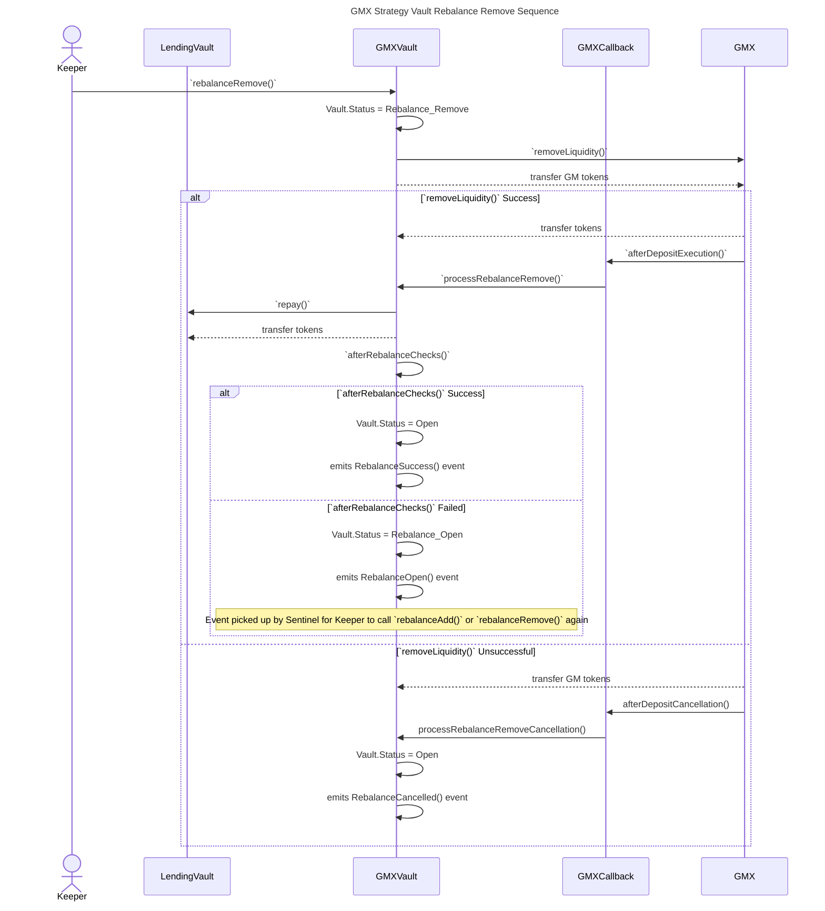

```mermaid
---
title: GMX Strategy Vault Rebalance Remove Sequence
---
sequenceDiagram
  actor Keeper
  participant LendingVault
  participant GMXVault
  participant GMXCallback
  participant GMX

  Keeper ->> GMXVault: `rebalanceRemove()`
  GMXVault ->> GMXVault: Vault.Status = Rebalance_Remove
  GMXVault ->> GMX: `removeLiquidity()`
  GMXVault -->> GMX: transfer GM tokens

  alt `removeLiquidity()` Success
    GMX -->> GMXVault: transfer tokens
    GMX ->> GMXCallback: `afterDepositExecution()`
    GMXCallback ->> GMXVault: `processRebalanceRemove()`
    GMXVault ->> LendingVault: `repay()`
    GMXVault -->> LendingVault: transfer tokens
    GMXVault ->> GMXVault: `afterRebalanceChecks()`

    alt `afterRebalanceChecks()` Success
      GMXVault ->> GMXVault: Vault.Status = Open
      GMXVault ->> GMXVault: emits RebalanceSuccess() event

    else `afterRebalanceChecks()` Failed
        GMXVault ->> GMXVault: Vault.Status = Rebalance_Open
        GMXVault ->> GMXVault: emits RebalanceOpen() event
        note over GMXVault: Event picked up by Sentinel for Keeper to call `rebalanceAdd()` or `rebalanceRemove()` again
    end

  else `removeLiquidity()` Unsuccessful
    GMX -->> GMXVault: transfer GM tokens
    GMX ->> GMXCallback: afterDepositCancellation()
    GMXCallback ->> GMXVault: processRebalanceRemoveCancellation()
    GMXVault ->> GMXVault: Vault.Status = Open
    GMXVault ->> GMXVault: emits RebalanceCancelled() event
  end
```
