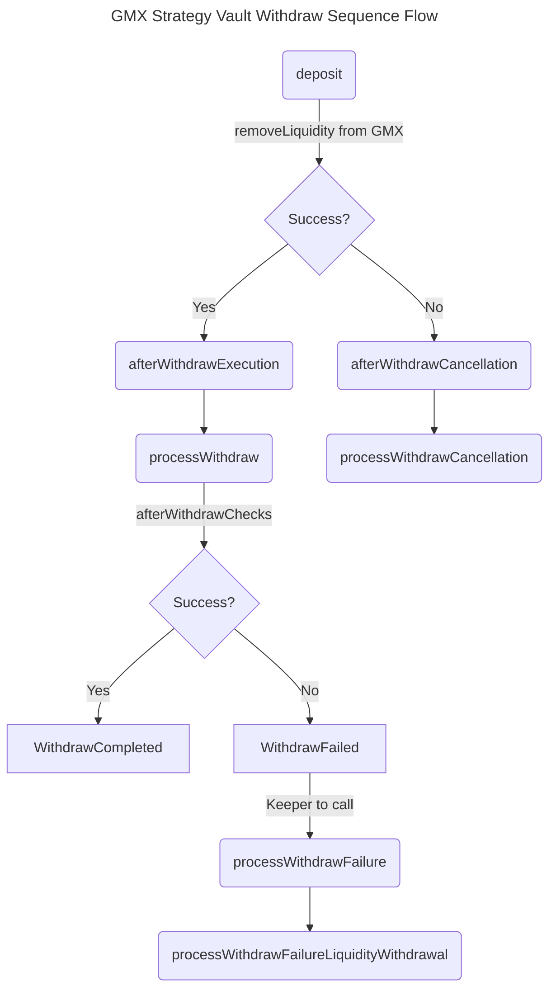

```mermaid
---
title: GMX Strategy Vault Withdraw Sequence Flow
---
flowchart TD
  F1(deposit) -->|removeLiquidity from GMX| S1{Success?}
  S1{Success?} -->|Yes| F2(afterWithdrawExecution)
  S1{Success?} -->|No| F3(afterWithdrawCancellation)

  F2(afterWithdrawExecution) --> F4(processWithdraw)
  F4(processWithdraw) -->|afterWithdrawChecks| S2{Success?}

  S2{Success?} -->|Yes| DC[WithdrawCompleted]
  S2{Success?} -->|No| DF[WithdrawFailed]

  DF[WithdrawFailed] -->|Keeper to call| F5(processWithdrawFailure)
  F5(processWithdrawFailure) --> F6(processWithdrawFailureLiquidityWithdrawal)

  F3(afterWithdrawCancellation) --> F7(processWithdrawCancellation)
```