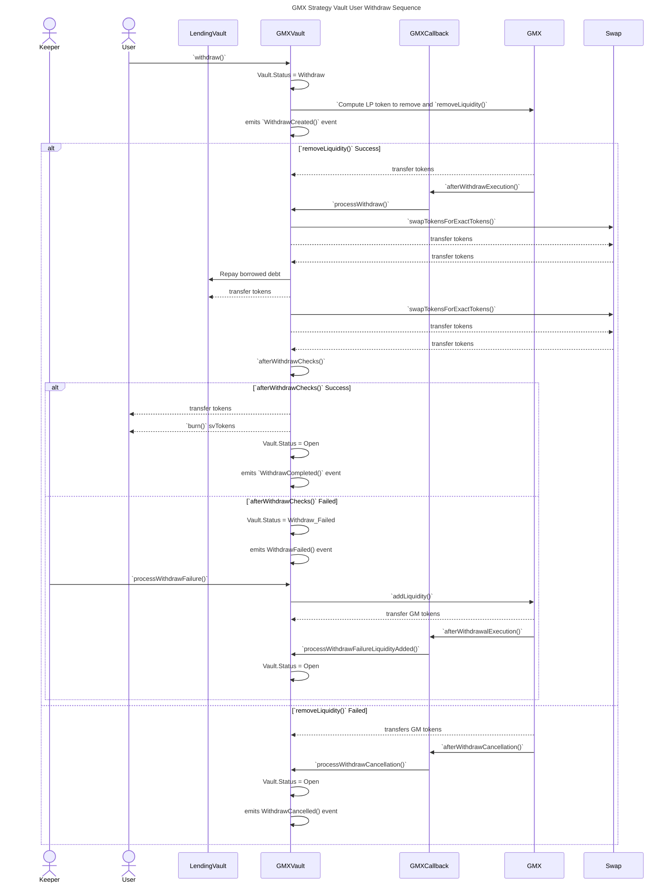

```mermaid
---
title: GMX Strategy Vault User Withdraw Sequence
---
sequenceDiagram
  actor Keeper
  actor User
  participant LendingVault
  participant GMXVault
  participant GMXCallback
  participant GMX
  participant Swap

  User ->> GMXVault: `withdraw()`
  GMXVault ->> GMXVault: Vault.Status = Withdraw
  GMXVault ->> GMX: `Compute LP token to remove and `removeLiquidity()`
  GMXVault ->> GMXVault: emits `WithdrawCreated()` event
  alt `removeLiquidity()` Success
    GMX -->> GMXVault: transfer tokens
    GMX ->> GMXCallback: `afterWithdrawExecution()`
    GMXCallback ->> GMXVault: `processWithdraw()`
    GMXVault ->> Swap: `swapTokensForExactTokens()`
    GMXVault -->> Swap: transfer tokens
    Swap -->> GMXVault: transfer tokens

    GMXVault ->> LendingVault: Repay borrowed debt
    GMXVault -->> LendingVault: transfer tokens

    GMXVault ->> Swap: `swapTokensForExactTokens()`
    GMXVault -->> Swap: transfer tokens
    Swap -->> GMXVault: transfer tokens

    GMXVault ->> GMXVault: `afterWithdrawChecks()`

    alt `afterWithdrawChecks()` Success
      GMXVault -->> User: transfer tokens
      GMXVault -->> User: `burn()` svTokens
      GMXVault ->> GMXVault: Vault.Status = Open
      GMXVault ->> GMXVault: emits `WithdrawCompleted()` event

    else `afterWithdrawChecks()` Failed
      GMXVault ->> GMXVault: Vault.Status = Withdraw_Failed
      GMXVault ->> GMXVault: emits WithdrawFailed() event

      Keeper ->> GMXVault: `processWithdrawFailure()`
      GMXVault ->> GMX: `addLiquidity()`
      GMX -->> GMXVault: transfer GM tokens
      GMX ->> GMXCallback: `afterWithdrawalExecution()`
      GMXCallback ->> GMXVault: `processWithdrawFailureLiquidityAdded()`
      GMXVault ->> GMXVault: Vault.Status = Open
    end

  else `removeLiquidity()` Failed
    GMX -->> GMXVault: transfers GM tokens
    GMX ->> GMXCallback: `afterWithdrawCancellation()`
    GMXCallback ->> GMXVault: `processWithdrawCancellation()`
    GMXVault ->> GMXVault: Vault.Status = Open
    GMXVault ->> GMXVault: emits WithdrawCancelled() event
  end
```
