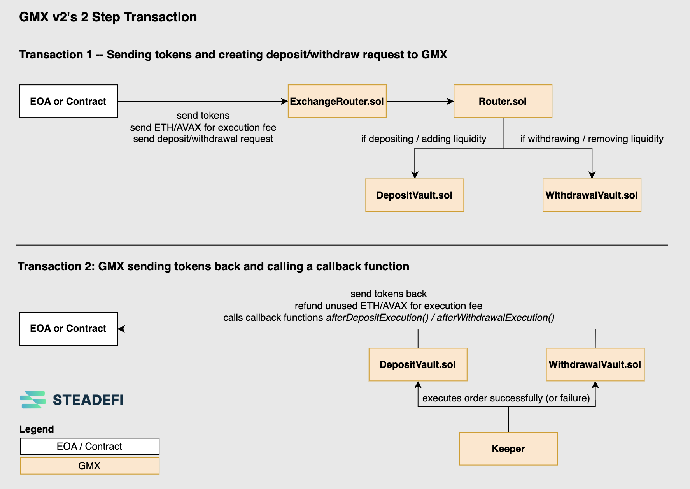
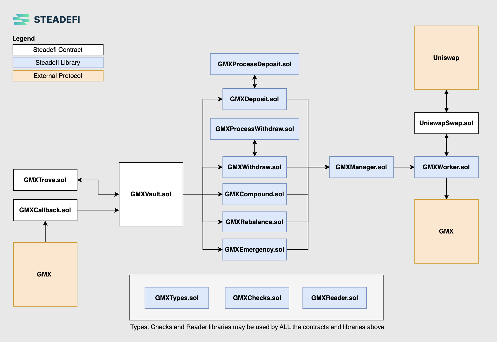

# Technical Documentation

# Table of Contents
- [Protocol Overview](#protocol-overview)
  - [Actors](#actors)
- [Lending Vaults](#lending-vaults)
  - [Profit Sharing Rates](#profit-sharing-rates)
  - [Lending Vault Actions](#lending-vault-actions)
- [Strategy Vaults](#strategy-vaults)
  - [Delta Long](#delta-long)
  - [Delta Neutral](#delta-neutral)
  - [Automated Rebalancing](#automated-rebalancing)
  - [GMX v2 High Level Sequence](#gmx-v2-high-level-sequence)
  - [Strategy Vault Contracts Architecture](#strategy-vault-contracts-architecture)
  - [Strategy Vault Actions](#strategy-vault-actions)
  - [Strategy Vault Sequence Diagrams](#strategy-vault-sequence-diagrams)

 

# Protocol Overview
There are 2 types of vaults: **Lending Vaults** and **Strategy Vaults**.

A typical set up for 3x Leverage, Delta Long and Delta Neutral strategies to the ETH-USDC GM LP pool on GMXv2, with isolated ETH and USDC lending vaults are as follows:

> Note that Delta Long strategies borrow only USDC for more leverage, while Delta Neutral strategies borrow both USDC for leverage **as well as** borrow ETH in order to delta hedge the ETH exposure of the liquidity provided to the ETH-USDC GM LP pool (borrowing = hedging).

## Actors
| Role | Responsibilities |
| ------ | --------------- |
| Lender | Lenders deposit assets to Lending Vaults (1 asset per Lending Vault) to earn safer, more stable borrow interest on their assets. |
| Depositor | Depositors deposit assets to Strategy Vaults (Strategy Vaults could accept different assets) to earn earn higher yields than if they were to supply their assets to the yield-earning protocol directly. Depending on the strategy however, they take on different types of risk which would affect their final profit and losses. |
| Keeper | Keepers are automated "bots" that run 24/7, frequently scheduled and/or event-triggered code scripts to perform various protocol maintainence tasks. These tasks include updating of borrow interest rates for Lending Vaults, rebalancing Strategy Vaults whose health are out of its' strategy parameter limits, compounding earned yield for Strategy Vaults, reverting certain issues for strategy vaults when they occur and triggering Emergency Pauses for lending and strategy vaults in the event of any possible issues. |
| Owner | Owner are administrators that have rights to configure and update various sensitive vault configurations and parameters. Owners of deployed smart-contracts (vaults, oracles, etc.) should be Timelocks of which are managed by Multi-Sigs that require at least a 2 out of 3 signing approval for any transactions to happen with a 24 hours delay. Note that on contract deployment, the immediate Owner is the hot wallet deployer account. After deploying and initial configuration of the contract, the ownership should be immediately transferred from the hot wallet deployer to a Timelock managed by a Multi-Sig. |

 

# Lending Vaults
Lending vaults are single asset vaults that lend out its' assets to strategy vaults to allow strategy vaults to carry out their intended strategy. Lending vaults's yield come from charging interest to strategy vaults for assets borrowed.

Steadefi implements **Isolated Lending Vaults** to cater to different strategy vaults. Although this fragments lending asset liquidity (e.g. there can be mutliple USDC Lending Vaults), this further isolates risks to both Lenders and Depositors, and allow Lenders to more granularly decide the yield (and corresponding risk) of their assets being lent out to strategies.

> *If a user simply wants to reliably accumulate more of an asset without concern of the USD value of the asset over time, while looking for a more stable, reliable return profile, it is more beneficial to lend out assets in a Lending Vault.*

**Lenders** can deposit individual assets to **Lending Vaults** in exchange for shares of the **Lending Vault (lvToken)**.

The benefits to Lenders are:
- Earn safer and more stable yield in the form of the asset being lent out
- No exposure to impermanent loss

**Keepers** regularly check and update every lending vault's borrow interest rates based on the Yield APR of the strategy vault's that is borrowing assets from it. See *Profit Sharing Rates* section for more details.

## Profit Sharing Rates
Most existing DeFi Lending Vaults uses a Utilization Rate model to determine their borrow rates.

For borrowers (strategy vaults), the largest concern with the “utilization rate” system is the potential negative APRs on their position. In this case, the borrowing rates would be higher than their yields, effectively putting them in a losing position until more lending funds are deposited or borrowers reduce their position. As it does not make sense for borrowers to have negative yield, such situations may ultimately reduce the demand for borrows in the long-run, which overall reduces the interest earned to lenders.

For lenders (lending vaults), the returns they receive are limited by a linear model that is based entirely on the “utilization rate”. This means that lenders make significant yields on their deposits when borrowing is high, and likewise they earn very little yield when borrowing is low.

Steadefi implements a Profit Sharing Model that aim to address the above issues by adjusting the borrow rates charged by lenders based on the Yield APRs being earned by borrowers:
- When Yield APRs are high for Strategy Vaults, Borrow Interest is increased by Lenders
- When Yield APRs are low for Strategy Vaults, Borrow Interest is decreased by Lenders

The adjustment is done by automated **Keepers**.

This effectively results in a "profit sharing" situation, where lenders stand to earn higher returns when yields are high for strategy vaults (beneficial to lenders) but may also earn lower returns when yields are low for strategy vaults (beneficial to strategy vaults, which keeps them borrowing for longer rather than leaving).

## Lending Vault Actions
All actions possible to a Lending Vault and their expected outcome and impact, grouped by access to roles.

- **Owner**: The vault's initial owner is the deployer, which will be a hot wallet. Certain actions will be triggered immediately post-deployement as part of the vault's initialization and configuration. Immediately after initialization, the ownership will be transferred to a Timelock contract which is owned by a Multi-Sig that requires at least a 2/3 signing for execution of any proposed actions, with at least a 24 hour delay.
- **Keeper**: Keepers are OpenZeppelin Defender Relayer accounts that run autotasks triggered on a scheduled frequency or event that matched a set rule. In the future, keepers may be decentralized with Chainlink Automation or Gelato Keepers.
- **Vault**: An approved Steadefi strategy vault that can borrow/repay from the lending vault
- **User**: Either a depositor or a lender for the lending vault.
- **Any**: Any of the above / public.

| Role  | Action | Expected Impact |
| ----- | ------ | --------------- |
| Owner | approveBorrower | Approve a strategy vault to allow it to borrow assets |
| Owner | revokeBorrower | Revoke a strategy vault to allow it to borrow assets |
| Owner | updateKeeper | Approve or revoke an address to have "keeper" role |
| Owner | updateTreasury | Update protocol's treasury address for this vault |
| Owner | updatePerformanceFee | Update performance fee for vault |
| Owner | updateMaxCapacity | Update maximum capacity for deposits allowed for this vault |
| Owner | emergencyResume | Unpauses vault so asset deposits/withdrawals/borrows are allowed. |
| Keeper | updateInterestRate | Pauses vault so no asset deposits/withdrawals/borrows are allowed. |
| Keeper | withdrawReserve | Withdraw fees that were charged but not withdrawn from this vault |
| Keeper | emergencyShutdown | Pauses vault so no asset deposits/withdrawals/borrows are allowed. |
| Keeper | emergencyRepay | Allows keeper to repay debt for an existing borrower with debt |
| Vault | borrow | Borrow assets from this vault |
| Vault | repay | Repay assets from this vault |
| User | deposit | Deposit assets in exchange for lending vault share tokens (lvToken) |
| User | depositNative | Deposit native assets (ETH, AVAX, etc.) in exchange for lending vault share tokens (lvToken) |
| User | withdraw | Withdraw assets in exchange for lending vault share tokens (lvToken) |
| Any | totalAsset | Returns total amount of deposited assets in the lending vault |
| Any | totalAvailableAsset | Returns total amount of available assets that can be borrowed in the lending vault |
| Any | utilizationRate | Returns current total borrowed / total deposited rate |
| Any | lvTokenValue | Returns the lending vault token value: total assets / total lvToken shares |
| Any | borrowAPR | Returns current interest rate charged to borrowers |
| Any | lendingAPR | Returns current interest rate yield given to lenders |
| Any | maxRepay | Returns maximum amount repayable by a borrower

 

# Strategy Vaults
**Strategy vaults** are multi-asset vaults that carry out a particular yield-earning strategy via taking on under-collaterised borrowing from lending vaults. Strategy vaults earn yield by collecting fees by providing its' assets to external protocols for usage, typically in the form of swap/trading/lending/staking liqudity.

**Strategy vaults** can vary by:
- Leverage (3x, 5x, etc.)
- Delta (Delta Long or Delta Neutral to the underlying volatile asset(s))
- Yield Source(s) (Usually by providing liqudiity to Automated Market Makers, Perpetual Exchanges, Liquid Staking)
- Underlying Assets (ETH, WBTC, USDC, etc.)

> *Delta refers to the directional risk associated with the price movements of an underlying asset.*

## Delta Long
A Delta Long strategy (also known as Delta 1) means that the USD value of your position would be directly correlated with the price movement of an underlying asset (i.e. if the asset's price increases, your position value should also increase, and vice versa).

Example:
1) Price of ETH is USD $1000 and price of 1 USDC is USD $1. The value of a ETH-USDC LP token with 50% token weight in ETH and 50% in USDC is USD $1.
2) A depositor deposits 1 USDC (equity value) to a 3x Long ETH-USDC strategy vault, which borrows 2 USDC (debt value) for a total of 3 USDC (asset value), which it then adds liquidity for 3 ETH-USDC LP tokens.
3) **If the price of ETH increases** 50% to USD $1500, the value of the ETH-USDC LP token should increase by 25% to $1.25. The asset value of the vault would be $3.75, the debt value still remains at $2 and the equity value is $1.75 (asset - debt), effectively earning a 75% return on equity before paying borrow interest or accounting for earned yield.
4) **If the price of ETH decreases** 50% to USD $500, the value of the ETH-USDC LP token should decrease by 25% to $0.75. The asset value of the vault would be $2.25, the debt value still remains at $2 and the equity value is $0.25 (asset - debt), effectively losing 75% on equity before paying borrow interest or accounting for earned yield.

> *If you hold the belief that the price of the volatile asset is mostly going up over time, it is more beneficial to deposit in a Leveraged Delta Long strategy.*

## Delta Neutral
A Delta Neutral strategy (also known as Delta 0) means that the USD value of your position value is not directly correlated with the price movement of an underlying asset (i.e. if the asset's price increases OR decreases, your position value does not increase OR decrease as significantly as the price changes both-ways are hedged).

Example:
1) Price of ETH is USD $1000 and price of 1 USDC is USD $1. The value of a ETH-USDC LP token with 50% token weight in ETH and 50% in USDC is USD $1.
2) A depositor deposits 1 USDC (equity value) to a 3x Neutral ETH-USDC strategy vault, which borrows $1.50 USD worth of ETH (to hedge out the total ETH amount of $1.50 in the final $3 asset value position) and 0.50 USDC (for a combined debt value of $2) for a total of 3 USD worth of assets (asset value), which it then adds liquidity for 3 ETH-USDC LP tokens.
3) **If the price of ETH increases** 50% to USD $1500, the value of the ETH-USDC LP token should increase by 25% to $1.25. The asset value of the vault would be $3.75, the debt value would be $2.375 ($1.50 -> $1.875 ETH + $0.50 USDC) and the equity value is $1.375 (asset - debt), effectively earning a 37.5% return on equity before paying borrow interest or accounting for earned yield.
4) **If the price of ETH decreases** 50% to USD $500, the value of the ETH-USDC LP token should decrease by 25% to $0.75. The asset value of the vault would be $2.25, the debt value will decrease to $1.25 ($1.50 -> $0.75 ETH + $0.50 USDC) and the equity value is $1 (asset - debt), effectively having a 0%  gain/loss on equity before paying borrow interest or accounting for earned yield. In this scenario, if the yield earned is higher than the borrow interest, the depositor will make a positive return despite the price of ETH decreasing by 50%.

> *If you hold the belief that the price of the volatile asset is going to stay within a range (crabbish) or perhaps would even decrease slightly over time, it is more beneficial to deposit in a Leveraged Delta Neutral strategy.*

**Depositors** can deposit accepted assets into strategy vaults in exchange for shares of the **Strategy Vault (svToken)**.

**Keepers** regularly check and maintain every vault's target leverage and delta strategy. This means that depositors to these strategy vaults do not have to manually manage their own position's strategy.

The benefits to Depositors are:
- Earn higher yields due to under-collaterised borrowing with the same amount of assets owned
- 24/7 automated strategy rebalancing instead of manual rebalancing
- No liquidation
- Auto-compounding of yields earned
- No negative yield (i.e. no risk of borrow rates being higher than yield earning rates). See *Profit Sharing Rates* section for more details.

## Automated Rebalancing
A leverage delta strategy will change over time due to changes in the volatile asset price, borrow interest rates and yield earning rates.

This results in a strategy's debt ratio and/or delta to possibly "drift" too far from it's intended target leverage and delta strategy. Depending on how things play out, such drifts "away" from the intended target strategy could also back to it's target (good), but could also drift even further (not good as it is not executing on its intended strategy).

As such, constant maintainence of a vault's strategy should be adhered to in order to keep its integrity over a period of time to allow for a safer and more reliable yield earning strategy.

Steadefi strategy vaults have min/max parameters for debt ratio and delta. Keepers will constantly check if the strategy vaults have exceeded these parameters, and if so, automatically trigger a rebalance such that the vault's debt ratio and delta is reset back to it's intended target leverage and delta hedge.

Note that the intention is not to over-rebalance, as every rebalance incurs a cost to the strategy vault. As such, the parameters set for every vault in order to determine when a vault should rebalance comes from the team's quant research and experience on a best effort basis, and depending on market conditions, may be updated over time.

## GMX v2 High Level Sequence

Unlike most existing DeFi protocols, GMX version 2 features a "2 step" process for various asset transfer transactions:
- adding liquidity (buy GM tokens)
- removing liquidity (sell GM tokens)
- swaps (swapping assets in a GM pool; this is not used in Steadefi's existing vaults)

A high level diagram explaining the flow is as follows (note that this is an unofficial diagram from Steadefi so only take this as an illustrative diagram):

As such, Steadefi's vaults have to be designed to handle this 2 transaction process in order to correctly and automatically handle successful (and failed) transactions.

For example, when a Depositor is depositing to a Vault which will add liquidity to GMX to ETH-USDC GM pool:

- First transaction:
  - Deposit calls `deposit()` to Vault and sends deposit tokens
  - Vault will send deposit tokens (e.g. USDC) to ExchangeRouter
  - Vault will send native gas tokens for execution fee (e.g. ETH) to ExchangeRouter
  - Vault will send a `createDeposit()` transaction with `CreateDepositParams` to ExchangeRouter
- GMX keepers will execute the 2nd transaction:
  - Swaps deposit tokens for LP (ETH-USDC GM) tokens
  - Sends LP tokens to Vault
  - Calls `afterDepositExecution()` to callback contract address of Vault (if successful deposit)
    - Vault computes how many Vault share tokens to mint and send to Depositor
  - Refund unused native gas back to Vault
    - Vault refunds unused gas tokens to Depositor

There are several points in this 2 transaction flow where things may revert, and the Vault will have to be able to handle it accordingly.

- [Before 1st Transaction] If a user's deposit does not meet requirements / checks
- [Before 1st Transaction] If a user did not send enough execution fee
- [Before 1st Transaction] If there is not enough lending liquidity to borrow
- [After 1st Transaction] Deposit to GMX reverted (e.g. due to slippage); considered as a "Desposit Cancellation" by GMX
- [After 1st Transaction] GMX did not call Vault's callback function or callback function reverted for any reason
- [After 1st Transaction] `afterDepositChecks()` failed (e.g not enough minimum shares minted)

We have tried to map out the high level and detailed sequences for the various interactions with GMX v2 here: [High level and detailed sequence flows and diagrams are available in `/sequences`](./sequences/)

## Strategy Vault Contracts Architecture

Steadefi's vault contracts are architectured using numerous re-usable external libraries that deployed vault contracts must reference to. It is implemented as such as our vaults require more functions and code for various checks and functions to handle various actions (see Strategy Vault Actions table section).

Our architecture allows us to be able to have these functions while keeping within Solidity's contract size limits. Note that the external libraries are supposed to be re-usable by new strategy vault contracts deployed to GMX v2.

A diagram on how these contracts work with one another are as follows:

## Strategy Vault Actions
All actions possible to a Strategy Vault and their expected outcome and impact, grouped by access to roles.

- **Owner**: The vault's initial owner is the deployer, which will be a hot wallet. Certain actions will be triggered immediately post-deployement as part of the vault's initialization and configuration. Immediately after initialization, the ownership will be transferred to a Timelock contract which is owned by a Multi-Sig that requires at least a 2/3 signing for execution of any proposed actions, with at least a 24 hour delay.
- **Keeper**: Keepers can be the Vault's Callback contract or OpenZeppelin Defender Relayer accounts that run autotasks triggered on a scheduled frequency or event that matched a set rule. The Vault's Callback contract are given keeper roles in the event that callbacks fail, we can utilise keepers to call these functions to process the actions and status of the vault. We can also utilise OpenZeppelin Sentinel to monitor for Events emitted by GMX to then trigger keeper (autotasks) actions. In the future, keepers may be decentralized with Chainlink Automation or Gelato Keepers.
- **Vault**: Referring only to the strategy vault itself.
- **User**: A depositor to the strategy vault.
- **Any**: Any of the above / public.

| Role  | Action | Expected Impact |
| ----- | ------ | --------------- |
| Owner | updateKeeper | Approve or revoke an address to have "keeper" role |
| Owner | updateTreasury | Update protocol's treasury address for this vault |
| Owner | updateSwapRouter | Update the external router where assets are swapped at for this vault |
| Owner | updateCallback | Update the Callback contract which handles callbacks from GMX. This function should only be called once on the post-deployment and as part of this vault's initialization
| Owner | updatefeePerSecond | Update management fee for vault |
| Owner | updateParameterLimits | Update vault's strategy debt ratio and delta parameter limits of which if crossed, the vault shoudl be rebalanced. Also updates the after deposit/withdraw "Guard Check" for the step change threshold for debt ratio step |
| Owner | updateMinSlippage | Update the minimum amount of slippage that should be passed in for adding/removing liquidity and asset swaps |
| Owner | updateMinExecutionFee | Update the minimum amount of execution fee that has to be passed in for actions that require it (adding/removing liquidity) |
| Keeper | processDeposit | Called after a successful add liquidity to GMX, from a user deposit action. Proceeds to perform after deposit health checks of the vault and mint vault shares tokens to depositor. Should be called via a Callback. |
| Keeper | processDepositCancellation | Called after add liquidity to GMX has failed -- usually due to an overly aggressive slippage requirement, after a user deposit action. Proceeds to repay borrowed assets and return the deposited assets to the user. Should be called via a Callback. |
| Keeper | processDepositFailure | Called after add liquidity to GMX has succeeded after a user deposit action, but after deposit checks of the vault's health has failed. Proceeds to withdraw the liquidity that was just added from GMX. Should be called via a Sentinel event monitored triggered autotask keeper action. |
| Keeper | processDepositFailureLiquidityWithdrawal | Called after liquidity is successfully removed from GMX via processDepositFailure(). Proceeds to repay the assets borrowed from the initial deposit, and returns the remaining assets to the depositor. Should be called via a Callback. |
| Keeper | processWithdraw | Called after a successful removal of liquidity from GMX, from a user withdraw action. Proceeds to calculate, swap -- if needed -- and repay assets for debt, and perform after withdrawal health checks of the vault, transfering assets to the withdrawer and burn vault shares tokens of withdrawer. Should be called via a Callback. |
| Keeper | processWithdrawCancellation | Called after removal of liquidity from GMX has failed -- usually due to an overly aggressive slippage requirement, after a user withdraw action. No action needed beyond resetting status of the vault to Open. Should be called via a Callback. |
| Keeper | processWithdrawFailure | Called after removal of liquidity from GMX has succeeded after a user withdraw action, but after withdrawal checks of the vault's health has failed. Proceeds to re-borrow the assets that were just repaid, and re-add assets as liquidity to GMX. Should be called via a Sentinel event monitored triggered autotask keeper action. |
| Keeper | processWithdrawFailureLiquidityAdded | Called after liquidity is successfully added from GMX via processWithdrawFailure(). Proceeds to reset the vault's status to Open. Should be called via a Callback. |
| Keeper | rebalanceAdd | Rebalance vault while borrowing more assets and adding more liquidity to GMX. Should be called via a scheduled keeper autotask. |
| Keeper | processRebalanceAdd | Called after a successful add liquidity to GMX, from a rebalanceAdd() action. Performs after rebalance add checks. Should be called via a Callback. |
| Keeper | processRebalanceAddCancellation | Called after add liquidity to GMX has failed -- usually due to an overly aggressive slippage requirement, after a rebalance add action. Proceeds to repay borrowed assets and return the deposited assets to the user. Should be called via a Callback. |
| Keeper | rebalanceRemove | Rebalance vault while reducing debt, first by removing liquidity from GMX. Should be called via a scheduled keeper autotask. |
| Keeper | processRebalanceRemove | Called after a successful removal of liquidity from GMX, from a rebalanceRemove() action. Performs repayment of assets and after rebalance remove checks. Should be called via a Callback. |
| Keeper | processRebalanceRemoveCancellation | Called after removing liquidity from GMX has failed -- usually due to an overly aggressive slippage requirement, after a rebalance remove action. Proceeds to reset vault's status to Open. Should be called via a Callback. |
| Keeper| compound | Compounds token -- typically given as a bonus reward --  by swapping the token to one of the accepted asset in the vault and adding it for more liquidity to GMX |
| Keeper | processCompound | Called after successful adding of from a compound() action. Resets vault status to Open. Should be called via a Callback. |
| Keeper | processCompoundCancellation | Called after failure of adding of liquidity from a compound() action. Resets vault status to Open. Should be called via a Callback. |
| Keeper | emergencyPause | Converts liquidity pool tokens to underlying assets and leave it it vault. Pauses vault so no asset deposits/borrows/rebalancing are allowed. |
| Owner | emergencyResume | Re-add liquidity to protocol using all assets in vault. |
| Keeper | processEmergencyResume | Set status of vault to open upon successful re-adding of liquidity from emergencyResume() |
| Owner | emergencyClose | Repays all borowed debt of vault and close vault for good. Should be called only after EmergencyPause() is called. |
| Vault | mint | Mints strategy vault share tokens |
| Vault | burn | Burns strategy vault share tokens |
| User | deposit | Deposit whitelisted asset (tokenA/tokenB/LP token) for strategy vault tokens shares |
| User | depositNative | Deposit native asset (ETH, AVAX, etc.) for strategy vault tokens shares |
| User | withdraw | Withdraw whitelisted asset (tokenA/tokenB/LP token) in exchange for strategy vault tokens shares |
| User | emergencyWithdraw | Emergency withdraw tokenA/tokenB assets in exchange for strategy vault tokens shares when vault has been shut down via EmergencyClose() |
| Any | mintFee | Mints strategy vault token shares as management fee to protocol treasury. |
| Any | store | Returns the vault's Store struct which holds numerous vault's configuration data and interaction caches |
| Any | isTokenWhitelisted | Returns whether the passed in address is a accepted token for deposits or withdrawals in this vault |
| Any | svTokenValue | Returns the vault's token value = total value of vault in USD / total supply of strategy vault tokens |
| Any | pendingFee | Returns the amount of shares to be minted as management fees to the vault  |
| Any | valueToShares | Returns the amount of shares given an equity value  |
| Any | convertToUsdValue | Returns the USD value of a given token amount |
| Any | tokenWeights | Returns the token weights of the assets in the liquidity pool of GMX |
| Any | assetValue | Returns the total value of token A & token B assets held by the vault. Assets = Debt + Equity |
| Any | debtValue | Returns the value of token A & token B debt held by the vault. Assets = Debt + Equity |
| Any | equityValue | Returns the value of token A & token B equity held by the vault. Assets = Debt + Equity |
| Any | assetAmt | Returns the total amount of token A & token B assets held by the vault |
| Any | debtAmt | Returns the total amount of token A & token B borrowed by the vault |
| Any | lpAmt | Returns the total amount of LP tokens held by the vault |
| Any | leverage | Returns the current leverage status of the vault (asset / equity)|
| Any | delta | Returns the current delta (tokenA equityValue / vault equityValue) |
| Any | debtRatio | Returns the debt ratio (tokenA and tokenB debtValue) / (total assetValue) of the vault |
| Any | additionalCapacity | Returns the amount (in USD value) that the vault can still accept as deposits |
| Any | capacity | Returns the total capacity of the vault (additionalCapacity + total equity value) |

## Strategy Vault Sequence Diagrams

To help illustrate the various flows for key transactions from our Vault to GMXv2, we have created some sequence diagrams:

[High level and detailed sequence flows and diagrams are available in `/sequences`](./sequences/)